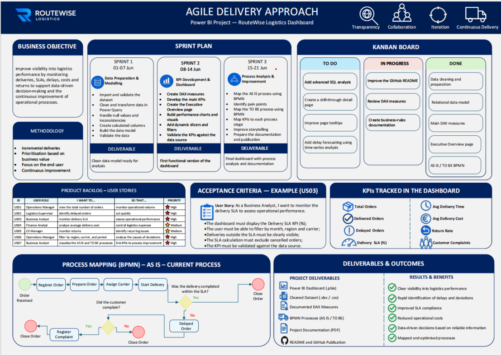
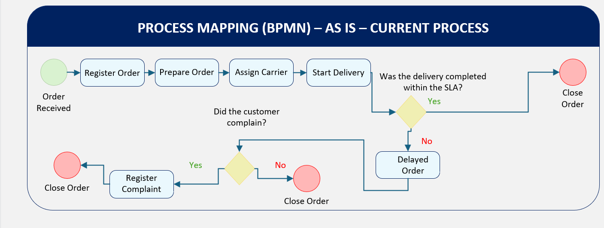
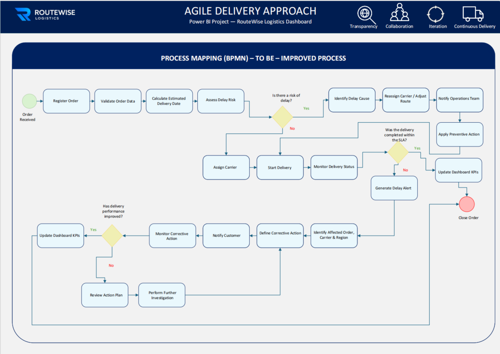
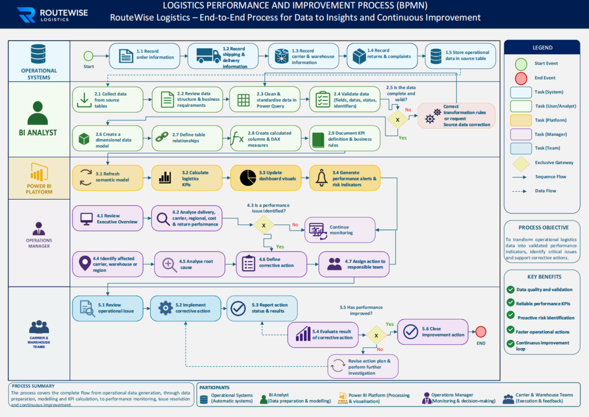

# RouteWise Logistics — BPMN Process Analysis & Improvement

## Project Overview

This project presents a **Business Analysis and process improvement case study** for RouteWise Logistics.

The objective was to analyse the current logistics workflow, identify operational pain points, define business requirements, and design an improved future-state process using **BPMN**.

The project focuses on:

- Business process analysis
- AS IS / TO BE process mapping
- Requirements analysis
- Stakeholder needs
- User stories
- Acceptance criteria
- Product backlog
- Business rules
- KPI-to-process alignment
- Root-cause analysis
- Process improvement
- Agile delivery
- Kanban
- Continuous improvement

> This is a fictitious case study created exclusively for educational and portfolio purposes.

---

## Business Objective

Improve logistics process performance by increasing visibility of operational issues, identifying delays and bottlenecks, and defining a more proactive workflow for risk identification and corrective action.

The proposed process aims to:

- Improve process visibility
- Identify operational bottlenecks
- Detect delivery risks earlier
- Improve SLA monitoring
- Clarify roles and responsibilities
- Support root-cause analysis
- Define preventive and corrective actions
- Improve stakeholder communication
- Connect operational KPIs with process improvement
- Establish a continuous improvement cycle

---

## Agile Delivery Approach

The project was structured using an Agile approach based on **transparency, collaboration, iteration, continuous delivery, business-value prioritisation, and continuous improvement**.



### Sprint 1 — Analysis Foundation

- Review the logistics business context
- Identify relevant operational data and KPIs
- Understand process participants and responsibilities
- Define the initial analysis scope

**Deliverable:** Structured foundation for process and requirements analysis.

### Sprint 2 — Requirements & Performance Analysis

- Define the main business requirements
- Identify stakeholder needs
- Create user stories
- Define acceptance criteria
- Map relevant KPIs to business needs
- Prioritise requirements based on business value

**Deliverable:** Prioritised requirements and product backlog.

### Sprint 3 — Process Analysis & Improvement

- Map the AS IS process using BPMN
- Identify pain points and process gaps
- Design the TO BE process
- Link KPIs to process stages
- Define preventive and corrective actions
- Document improvement opportunities

**Deliverable:** Final BPMN process analysis and improvement proposal.

---

## Product Backlog — User Stories

| ID | User Role | I Want To | So That | Priority |
|---|---|---|---|---|
| US01 | Operations Manager | View the total number of orders | Monitor operational volume | High |
| US02 | Logistics Supervisor | Identify delayed orders | Act quickly | High |
| US03 | Business Analyst | Monitor Delivery SLA | Assess operational performance | High |
| US04 | Finance Analyst | Analyse average delivery cost | Control logistics expenses | Medium |
| US05 | CX Manager | Monitor returns | Identify recurring issues | Medium |
| US06 | Operations Manager | Filter by region, carrier and period | Analyse the causes of deviations | High |
| US07 | Business Analyst | Visualise the AS IS and TO BE processes | Link KPIs to process improvement | High |

---

## Acceptance Criteria Example

### User Story — US03

**As a Business Analyst, I want to monitor the Delivery SLA so that I can assess operational performance.**

### Acceptance Criteria

- The Delivery SLA KPI must be available as a percentage.
- Users must be able to filter information by month, region, and carrier.
- Deliveries outside the SLA must be clearly identifiable.
- Cancelled orders must be excluded from the SLA calculation.
- The KPI must be validated against the source information.

---

## Business KPIs Considered

The process analysis considers the following operational indicators:

- Total Orders
- Delivered Orders
- Delayed Orders
- Delivery SLA (%)
- Average Delivery Time
- Average Delivery Cost
- Return Rate
- Customer Complaints

These KPIs are used as business-performance indicators and are linked to process monitoring and improvement opportunities.

---

# Process Analysis

## AS IS — Current Process

The AS IS model represents the current logistics workflow.



### Current Process Flow

1. Order received
2. Register order
3. Prepare order
4. Assign carrier
5. Start delivery
6. Verify whether delivery was completed within the SLA
7. Register delayed order when applicable
8. Register customer complaint when applicable
9. Close order

### Main Observation

The current process is predominantly **reactive**. Delays and customer complaints are addressed mainly after the issue has already occurred.

This limits the organisation's ability to anticipate delivery risk and intervene before SLA performance is affected.

---

## Key Pain Points Identified

- Reactive management of delivery delays
- Limited early identification of delay risk
- Limited preventive action before an SLA breach
- Weak connection between performance issues and corrective actions
- Limited visibility of the affected order, carrier, or region
- Unclear ownership of improvement actions
- Limited monitoring of corrective-action effectiveness

---

## TO BE — Improved Process

The TO BE model introduces a more proactive and structured workflow.



### Improved Process Flow

1. Order received
2. Register order
3. Validate order data
4. Calculate estimated delivery date
5. Assess delay risk
6. Identify delay cause when a risk is detected
7. Reassign carrier or adjust route when necessary
8. Notify the Operations Team
9. Apply preventive action
10. Assign carrier
11. Start delivery
12. Monitor delivery status
13. Verify SLA compliance
14. Generate a delay alert when necessary
15. Identify the affected order, carrier, and region
16. Define corrective action
17. Notify the customer
18. Monitor corrective action
19. Evaluate whether delivery performance improved
20. Review the action plan and perform further investigation when required
21. Update performance KPIs
22. Close order

### Main Improvement

The TO BE process moves the operation from **reactive issue management** toward **proactive risk identification, preventive action, structured corrective action, and continuous improvement**.

---

## AS IS vs TO BE

| Area | AS IS | TO BE |
|---|---|---|
| Risk management | Reactive | Proactive |
| Data validation | Limited before execution | Validation before delivery |
| Delay identification | Mainly after SLA impact | Risk assessed earlier |
| Preventive action | Limited | Embedded in the process |
| Alerts | Reactive identification | Structured delay alerts |
| Root-cause analysis | Limited | Explicit process step |
| Corrective actions | Less structured | Defined and assigned |
| Performance follow-up | Limited | Action effectiveness monitored |
| Continuous improvement | Not explicit | Embedded feedback loop |

---

# End-to-End Performance & Improvement Process

The end-to-end BPMN model connects operational information, performance monitoring, management decision-making, corrective actions, and continuous improvement.



## Process Objective

Transform operational logistics information into validated performance indicators, identify critical issues, support corrective actions, and create a continuous improvement loop.

---

## Process Participants

### Operational Systems

Responsible for recording operational information such as:

- Orders
- Shipping and delivery information
- Carrier and warehouse information
- Returns
- Complaints

### BI Analyst

Supports the process by:

- Collecting information from source tables
- Reviewing data structure and business requirements
- Validating data fields, dates, statuses, and identifiers
- Supporting KPI definitions and business rules

### Power BI Platform

Supports performance monitoring by:

- Refreshing performance information
- Calculating logistics KPIs
- Updating visual information
- Generating alerts and risk indicators

### Operations Manager

Responsible for:

- Reviewing operational performance
- Identifying performance issues
- Identifying the affected carrier, warehouse, or region
- Analysing root causes
- Defining corrective actions
- Assigning actions to responsible teams

### Carrier & Warehouse Teams

Responsible for:

- Reviewing operational issues
- Implementing corrective actions
- Reporting action status and results
- Supporting improvement evaluation

---

## Continuous Improvement Cycle

The process includes a feedback loop:

1. Identify a performance issue
2. Analyse the root cause
3. Define corrective action
4. Assign responsibility
5. Implement the action
6. Measure the result
7. Evaluate performance improvement
8. Close the action when effective
9. Revise the action plan and investigate further when improvement is not achieved

This creates a structured mechanism for **continuous operational improvement**.

---

## Improvement Opportunities

The analysis identified the following improvement opportunities:

- Validate order information earlier
- Calculate estimated delivery dates
- Assess delay risk before execution
- Identify delay causes earlier
- Reassign carriers or adjust routes when needed
- Apply preventive actions before SLA breaches
- Generate structured delay alerts
- Notify Operations Teams earlier
- Improve customer communication
- Assign clear ownership to corrective actions
- Monitor corrective-action results
- Connect KPIs directly to process stages
- Use performance results to drive continuous improvement

---

## Stakeholders

| Stakeholder | Main Responsibility |
|---|---|
| Operations Manager | Monitor performance and define corrective actions |
| Logistics Supervisor | Identify delays and operational deviations |
| Business Analyst | Analyse requirements, processes, business rules, and improvement opportunities |
| Finance Analyst | Analyse logistics costs |
| CX Manager | Monitor returns and recurring customer issues |
| BI Analyst | Support KPI definitions and performance information |
| Carrier & Warehouse Teams | Execute preventive and corrective actions |

---

## Kanban

The project uses a Kanban approach to provide visibility into work status and prioritisation.

### Done

- Process scope definition
- Business objective definition
- Main KPI identification
- Product backlog
- User stories
- Acceptance criteria
- AS IS BPMN process
- TO BE BPMN process
- End-to-end BPMN process

### In Progress

- Business-rules documentation
- GitHub project documentation
- Process-analysis refinement

### Future Improvements

- Expand stakeholder requirements
- Add a formal gap-analysis matrix
- Add a requirements traceability matrix
- Expand business rules
- Add additional acceptance-criteria scenarios
- Include process-performance targets

---

## Results & Benefits

The proposed process supports:

- Better visibility of logistics processes
- Faster identification of operational deviations
- Improved SLA monitoring
- Proactive risk identification
- Better root-cause analysis
- Clearer roles and responsibilities
- Better stakeholder communication
- Structured preventive and corrective actions
- Improved traceability of business requirements
- Stronger connection between KPIs and process improvement
- Data-driven decision-making
- Continuous improvement

---

## Business Analysis Skills Demonstrated

- Business Analysis
- Requirements Gathering
- Requirements Analysis
- Business Requirements
- Functional Requirements
- Stakeholder Analysis
- Process Mapping
- BPMN
- AS IS / TO BE Analysis
- Gap Analysis
- Root-Cause Analysis
- Process Improvement
- Business Rules
- KPI Mapping
- Product Backlog
- User Stories
- Acceptance Criteria
- Agile
- Sprint Planning
- Kanban
- Continuous Improvement
- Process Documentation
- Data-Driven Decision-Making

---

## Repository Structure

```text
routewise-logistics-bpmn-process-analysis/
│
├── docs/
│   └── RouteWise_Logistics_BPMN_Portfolio.pdf
│
├── images/
│   ├── agile-delivery-approach.png
│   ├── as-is-process.png
│   ├── end-to-end-process.png
│   └── to-be-process.png
│
├── source/
│   └── RouteWise_Logistics_Process_Model.vsdx
│
├── .gitignore
├── LICENSE
└── README.md
```

---

## Project Deliverables

- Agile Delivery Approach
- Product Backlog
- User Stories
- Acceptance Criteria
- AS IS BPMN Process
- TO BE BPMN Process
- End-to-End Improvement Process
- Stakeholder Analysis
- Business Requirements
- KPI-to-Process Mapping
- Pain-Point Analysis
- Improvement Recommendations
- Process Documentation

---

## Disclaimer

This project is a fictitious case study created exclusively for educational and portfolio purposes.

No real customer, carrier, employee, or company information is included.

---

## Author

**Érica  Teodoro**

Business Analysis | Data Analysis | Process Improvement
